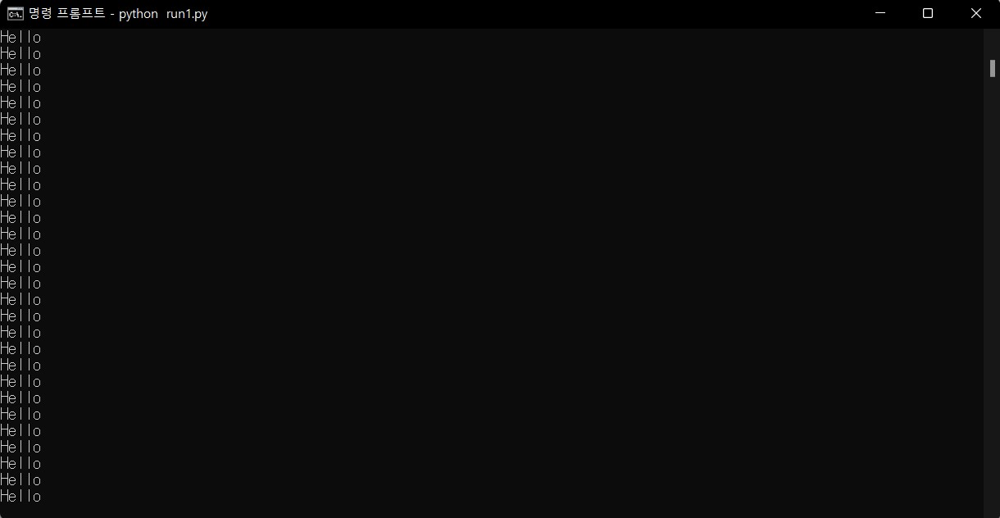

# Python 프로그램 실행 여부 판단, 실행/종료 기능 구현


```python
# psutil 설치
!pip install psutil
```

    Collecting psutil
      Downloading psutil-5.9.0-cp37-cp37m-win_amd64.whl (246 kB)
    Installing collected packages: psutil
    Successfully installed psutil-5.9.0


```python
import time
import psutil
import os, signal
```

## Python 특정 Script  실행 여부 판단하기


```python
# <run1.py>
# 1초마다 "Hello를 출력하는 스크립트: While문으로 계속 실행되고 있음."
# import time

# while 1:
#     print("Hello")
#     time.sleep(1)
```




```python
path = './'
target = 'run1.py'
```


```python
# 현재 실행 중인 python.exe 중 프로그램 이름이 target인 파일 찾기
check = [p.info for p in psutil.process_iter(attrs=['pid', 'name','cmdline']) if ('python' in p.info['name'] and p.cmdline()[-1] == target)]
```


```python
print(check)
```

    [{'name': 'python.exe', 'pid': 13708, 'cmdline': ['python', 'run1.py']}]


```python
if len(check) > 0:
    print(target + " is running")
else:
    print(target + " is not running")
```

    run1.py is running


## 현재 실행 중인 Script 종료하기


```python
# check에 담아두었던 pid 값을 이용하여 Script를 종료시킨다.
pid = check[0]['pid']
os.kill(int(pid), signal.SIGINT)
print(target + " 프로그램이 종료되었습니다.")
```

    run1.py 프로그램이 종료되었습니다.


## Script 실행시키기


```python
# 지정된 경로에 있는 python Script 실행시키기
target_path = path + str(target)
os.system('python ' + target_path)
print(target + " 파일을 실행합니다.")
```

이 코드를 Jupyter Notebook에서 실행하면 아래의 그림처럼 Anaconda Prompt에서 실행되는 문제점이 있다.


이 실습 코드를 중지시키려다가 실행 중 인 다른 코드도 중지될 수 있다.


실습은 여기까지 하고 class로 만들어서 활용해야겠음.

## 정리


```python
class CheckCode:
    def __init__(self, path, target_file):
        self.start_time = time.time()
        self.path = path
        self.target = target_file
        self.target_path = self.path + str(target_file)
        self.pid = None
        self.turn_on = None

    def is_running(self):
        check = [p.info for p in psutil.process_iter(attrs=['pid', 'name','cmdline']) 
        if ('python' in p.info['name'] and p.cmdline()[-1] == self.target)]
        
        if len(check) > 0:
            self.turn_on = "Yes"
            self.pid = check[0]['pid']
            
        if self.turn_on != "Yes":
            print(self.target + " is not running")
            self.turn_on = "No"
        elif self.turn_on == "Yes":
            print(self.target + " is running")
                
        return self.turn_on
        
    def run_target(self):
        self.is_running()
        if self.turn_on == "Yes":
            print(self.target + " 파일이 실행 중 입니다.")
        else:
            self.turn_on = "Yes"
            print(self.target + " 파일을 실행합니다.")
            os.system('python ' + self.target_path)

    def stop_target(self):
        self.is_running()
        if self.turn_on == "Yes":
            if self.pid is not None:
                print(self.target + " 프로그램을 종료합니다.")
                os.kill(int(self.pid), signal.SIGINT)
            else:
                print(self.target + " pid값이 없습니다.")
        else:
            print(self.target + " 프로그램이 실행되어 있지 않습니다. 확인해주세요")
```
