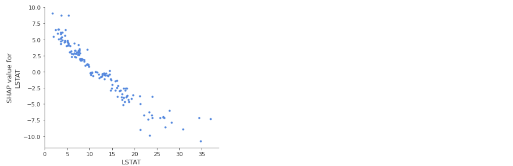

# SHAP

머신러닝, 딥러닝 모델의 정확도가 높아질수록 구조가 복잡해져 모델의 불투명도는 커지기 마련이다. 모델이 투명할수록 모델을 신뢰하고 적극적으로 사용할 수 있게 되기에 모델의 해석 가능 여부는 중요하다(Marino, Wickramasinghe, & Manic, 2018; Wang et al., 2020). 따라서 모델이 내린 예측 결과가 좋은지, 나쁜지에 대한 설명까지 가능해야 좋은 모델링이라고 할 수 있겠다. 이를 위한 방법으로 XAI(eXplainable Artificial Intelligence) 중 하나인 SHAP을 공부해보려고 한다.

**SHAP(Shapley Additive exPlanations)**는 Lundberg and Lee(2017). NeurlIPS(https://arxiv.org/abs/1705.07874)에서 발표된 내용이다. SHAP은 게임 이론(Game Theory)*을 따르는 최적의 Shapley Value를 기반으로한다.


*Game Theory
개인 또는 기업이 어떠한 행위를 했을 때, 그 결과가 게임에서와 같이 자신뿐만 아니라 다른 참가자의 행동에 의해서도 결정되는 상황에서, 자신의 최대 이익에 부합하는 행동을 추구한다는 수학적 이론


<span style='color:red'>Shapley</span> Additive exPlanations

## 1. Shapley Values

### 이해

게임 이론을 바탕으로 얻어낸 값이 바로 Shapley Value라고 한다. 아래의 그림으로 예를 들어보자. 아래 그림은 4명이 학생이 같은 수준의 시험을 다섯 차례 치르면서 나온 점수표이다.


4명의 학생들이 공교롭게도 한 번씩 시험에서 빠졌던 경우가 생겼다. 이 때 시험 점수 결과에 영향을 가장 많이 끼친 학생은 누구인가? 그 영향력은 어떻게 계산하는가? 에 대한 답으로 Shapley Value를 이해할 수 있다.


Shapley Value를 계산하는 예시를 들어서 그 과정을 이해해 보자. 입력 변수는 X1, X2, X3이며 학습 데이터에 대한 예측값 평균은 28이라고 가정한다. 새로운 관측치에 대해서 X1의 Shapley Value를 구해보자. 이를 위해서는 입력 변수에 대해 <u>모든 가능한 조합</u>을 생각해보아야 한다. 이를 아래의 표로 나타내보았다.(위의 시험 예시 내용과는 별개이다.)


먼저, X1 변수에 대한 Shapley value를 계산해보자. 변수를 예측에 사용하는지 여부에 따라 예측값을 비교한다. 중간 과정은 아래의 그림으로 표현할 수 있다. 먼저 X1에 대해 중간과정을 표현하고 반복과정은 생략했다.


위의 과정을 수식으로 표현하면 아래와 같다.


모든 변수에 대해 Shapley Value 값은 각각 3, 2, 2로 X1의 기여도가 크다라고 이해할 수 있다. 

### 단점

* Shapley value는 연산량이 너무 많다. (모든 순열에 대해 계산을 진행)
* 모델 학습 후의 산출물이기 때문에 인과관계로 해석할 수 없음.


Shapley <span style='color:red'>Additive exPlanations</span> 

## 2. Additive exPlanations

Addictive Feature Attribution 은 단순한 Explanation model을 이용하여 복잡한 구조의 Model을 해석하는 기법이다.  이러한 설명 기법에는 LIME, DeepLIFT, Layer-wise relevance propagation, Shapley values들이 포함된다.


Additive feature attribution이 하나의 해를 갖기 위해 가져야 할 조건은 아래와 같다.


3가지 조건에 대해서 맨 처음 언급한 4명의 학생이 시험을 치른 예시를 들어 설명하였다. 그리고 이 3가지의 조건들을 모두 만족하면 아래의 정리가 성립한다.


따라서, SHAP은 Shapley Value 를 사용하여 Additive Method 를 만족시키는 Explanation Model라는 결론이 나온다.


<span style='color:red'>SHAP</span>: Shapley Additive exPlanations

## 3. SHAP

SHAP는 LIME과 Shapley Value를 활용하여 대체한 추정 접근법인 **Kernel SHAP**와 트리 기반 모델을 위한 효율적인 추정 접근법인 **Tree SHAP**를 제안했다.

* **KernelSHAP**: 관측치 x에 대한 각 특성값의 예측 기여도를 추정한다. 
* **Tree SHAP**: 트리 기반의 머신러닝 모델*을 위한 SHAP의 변형으로  빠르고 정확한 Shapley value를 계산한다.
  (트리 기반의 머신러닝 모델: Decision Trees, Random Forests and Gradient Boosted trees 등)


### SHAP의 장점

SHAP는 게임 이론의 **확고한 이론적 기반**을 가지고 예측값에 대한 변수 별 영향력을 설명할 수 있다. 

**Tree SHAP의 빠른 계산속도를** 통해 모델 해석(eature importance, feature dependence, interactions, clustering and summary plots)에 필요한 많은 Shapley value를 계산할 수 있다.

### SHAP의 단점

Kernel SHAP는 **속도가 느리기** 때문에 모델 해석에 필요한 많은 Shapley value를 계산하기 어려울 수 있다. 

Shapley Value의 단점 또한 적용되기에, 모델 학습 후의 산출물이기 때문에 인과관계로 해석할 수 없다.


### 시각화와 해석

결국 실무의 모델링을 위해서는 시각화와 그의 해석이 중요하다.  예시와 함께 연습해보자. 예시에 사용된 데이터는 보스턴 집 값 예측 데이터이고 모델은 XGBoost을 이용했다.

1. Feature importance

- 변수 별 모델에 미치는 영향도(global importance)를 표현한다.
  데이터 전체에서 변수 별 Shapley values의 절댓값 평균을 구한다.
  x축은 Shapley values의 절댓값 평균, y축은 변수로 구성되어 있다.


​		예측 성능에 가장 큰 기여를 하는 변수는 LSTAT이고 그 뒤로 RM, PTRATIO, AGE를 거쳐 CHAS 순이다.


- feature importance와 feature effects를 결합하여 표현한다.
  x축은 Shapley value, y축은 변수로 구성되어 있다.
  y축의 정렬 순서는 위의 importance 순으로 정렬된다.

  

​		(직관적으로, 쉽게 이해가 되는 그래프는 아닌 것 같음)
​		붉은색, 푸른색은 변수 별 값의 높/낮음을 표현하고 X축에 따라 우측으로 갈수록 Shapley value가 커진다.
​		예를 들어, LSTAT가 작을수록 Shapley value가 커진다. Pred value에 더 큰 영향을 미친다. 정도로 해석할 수 있다.


2. Force_plot

- 특정 데이터에 대해 Shapley Value 를 1차원 평면에 정렬하여 시각화한다.
  예측값에 긍정적인 영향을 준 요인을 붉은색으로, 부정적인 요인을 푸른색으로 표현한다.
  Shapley values에 따라 막대 그래프의 크기를 표현하고 특정 데이터의 X 변수 값을 하단에 표기한다.


​		y_pred가 증가하는 쪽으로 영향을 준 변수는 B, ZN, RTPATIO, AGE 이고 이들 중 가장 큰 영향을 준 변수는 AGE로 나타났다.
​		y_pred가 감소하는 쪽으로 영향을 준 변수는 RM, DIS, CRIM, INDUS 이고 이들 중 가장 큰 영향을 준 변수는 RM로 나타났다.

​		증가/감소 양방향 모두 상위 3~4개의 변수만 시각화하고 나머지 변수들은 공간의 제약상 표기하지 않았다.


​		위 그래프는 데이터의 인덱스에 따라서 Shapley Value를 나타낸 것이다.


3. SHAP Dependence plot, Interaction Plot

- 변수 별 Shapley Value와의 관계(SHAP feature dependence)를 파악할 수 있다.
  x축은 변수, y축은 Shapley values으로 구성되어 있다.


​		LSTAT가 작아질수록 Shapley Value가 증가하고 커질수록 Shapley Value가 커진다.이는 summary_plot과도 같은 결과를 보여준다.


- Interaction Plots는 변수 간의 Shapley Value 추이도 파악할 수 있으나, 개인적으로는 직관적인것 같지 않다.


4. Clustering SHAP values

- Shapley value를 사용하여 데이터를 군집화할 수 있다.
   '유사성(Similarity)'의 순서대로 표현되었다고 한다. 


​		(개인적으로는 공부가 더 필요하다.)


** **궁금한 점**

PLSRegression이라는 머신러닝 기법에는 **<u>Variable Importance in Projection(VIP)</u>**이라는 지표가 있다. 이 지표는 Y 예측에 X가 기여한 정도라고 해석한다. 위에서 다룬 SHAP의 Shapley Value와 유사하다. 동일한 데이터를 가지고, PLS의 VIP와 SHAP Feature Importance를 비교하면 과연 비슷한 결과가 나올까?

(PLSRegression을 적용하기에 Boston 집값 데이터 예측 문제가 적절한지는 다음에 살펴보고, 현재는 결과만 비교해본다.)

​                                                               

RM, LSTAT, PTRATIO 모두 두 모델에서 영향력, 기여도가 큰 변수라고 해석할 수 있으나 그 순서가 다르고, AGE의 경우 많은 차이를 보였다. VIP 상에서는 9번째로 영향력을 갖는 변수이나 SHAP에서는 4번째로 영향력이 큰 변수로 해석한다. 두 지표간의 차이에 대하여 Study할 수 있었으면 좋겠다.


### Python Code

```python
import shap
import warnings
import numpy as np
import pandas as pd
import matplotlib.pyplot as plt

from xgboost import XGBRegressor
from xgboost import plot_importance 
from sklearn.datasets import load_boston # dataset
from sklearn.model_selection import train_test_split
from sklearn.metrics import mean_absolute_error, mean_squared_error

warnings.filterwarnings(action='ignore')

# 1. Load Data
boston = load_boston()
X = boston.data
y = boston.target
col_names = boston.feature_names

# 2. Split Train/Test
x_train, x_test, y_train, y_test = train_test_split(X, y, test_size = 0.3)

# 3. Fit the model
model = XGBRegressor(n_estimators=500, learning_rate=0.1, max_depth=3, reg_lambda=0.1, reg_alpha=0.5)
model.fit(x_train, y_train)

# 4. Predict Value
y_pred = model.predict(x_test)
y_true = y_test

mae = mean_absolute_error(y_true, y_pred)
mse = mean_squared_error(y_true, y_pred)
print(mae, mse)		# 2.238826034570995 11.438902046627648


# 5. Visualize Shap Values
shap.initjs()	# load js 
x_test_ = pd.DataFrame(x_test, columns=col_names)
explainer = shap.Explainer(model)
shap_values = explainer.shap_values(x_test_)

# 5-1. Feature importance
shap_v_means = pd.DataFrame(abs(shap_values)).mean()
print([f"{col_names[i]}: " + "{:.2f}".format(shap_v_means[i]) for i in range(len(col_names))])
shap.summary_plot(shap_values, x_test_, plot_type="bar")
```


```Python
shap.summary_plot(shap_values, x_test_)
```


```python
# 첫 번째 데이터에 대한 SHAP 시각화
print("Pred Value: ",round(y_pred[0],3))
print("Shapley Value \n", [f"{col_names[i]}: " + "{:.2f}".format(shap_values[0][i]) for i in range(len(col_names))])
shap.force_plot(explainer.expected_value, shap_values[0,:], x_test_.iloc[0,:])
```


```python
# 두 번째 데이터에 대한 SHAP 시각화
print("Pred Value: ",round(y_pred[1],3))
print("Shapley Value \n", [f"{col_names[i]}: " + "{:.2f}".format(shap_values[1][i]) for i in range(len(col_names))])
shap.force_plot(explainer.expected_value, shap_values[1,:], x_test_.iloc[1,:])
```


```python
# 전체 데이터에 대한 SHAP 시각화
shap.force_plot(explainer.expected_value, shap_values, x_test_)
```


```python
top_inds = np.argsort(-np.sum(np.abs(shap_values), 0))	# Shap_values에 따라 정렬
shap.dependence_plot(top_inds[0], shap_values, x_test_, interaction_index=None)
```




## 참고자료

Scott Lundberg et al. (2017). [A Unified Approach to Interpreting Model Predictions](https://papers.nips.cc/paper/2017/file/8a20a8621978632d76c43dfd28b67767-Paper.pdf)

Scott Lundberg et al. (2018). [Consistent Individualized Feature Attribution for Tree Ensembles](https://arxiv.org/pdf/1802.03888.pdf)

---

김성범[ 소장 / 인공지능공학연구소] 핵심 머신러닝 Shapley Value (Explainable AI): https://www.youtube.com/watch?v=f2XqxOny3NA

[고려대학교 DMQA Seminar] An Overview of Model-Agnostic Interpretation Methods: https://youtu.be/NF6kk8QkiHE

[SHAP] https://github.com/slundberg/shap

---

[Interpretable Machine Learning] A Guide for Making Black Box Models Explainable (Christoph Molnar. 2021)

* Shapley Values: https://christophm.github.io/interpretable-ml-book/shapley.html
* SHAP (SHapley Additive exPlanations): https://christophm.github.io/interpretable-ml-book/shap.html

[Kicarus Blog] https://kicarussays.tistory.com/32

[tobigs_xai Blog] https://velog.io/@tobigs_xai/2%EC%A3%BC%EC%B0%A8-SHAP-SHapley-Additive-exPlanation