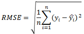

## 분류

분류(Classification): 지도학습의 대표적인 유형으로 주어진 데이터의 피처와 레이블값을 이용하여 모델을 학습하고 미지의 레이블 값을 예측하는 것.

*지도학습: 레이블 ,즉 명시적인 정답이 있는 데이터가 주어진 상태에서 학습하는 머신러닝 방식

**분류에 사용할 수 있는 다양한 알고리즘**

<ul>
    <li>Naive Bayes: 베이즈(Bayes)통계와 생성 모델에 기반한 알고리즘</li>
    <li>Logistic Regression: 독립변수와 종속변수의 선형 관계성 기반의 알고리즘</li>
    <li>Decision Tree: 데이터 균일도에 따른 규칙 기반의 알고리즘</li>
    <li>Support Vector Machine(SVM): 개별 클래스간의 최대 분류 마진을 효과적으로 찾는 알고리즘</li>
    <li>Nearest Neighbor: 근접 거리를 기준으로 분류하는 알고리즘</li>
    <li>Neural Network: 심층 연결 기반의 알고리즘</li>
    <li>Ensemble: 서로 다른(혹은 같은) 머신러닝 알고리즘을 결합한 형태의 알고리즘</li>
</ul>

### 1. Decision Tree

#### Decision Tree의 이해

Decision Node로 표시된 노드는 규칙 조건이 되는 것이고, Leaf Node로 표시된 노드는 결정된 클래스 값임.

새로운 규칙조건마다 Sub Tree 가 생성됨. 

데이터 세트 내에 피처가 결합해 규칙 조건을 만들 때마다 Decision Node가 되므로 많은 규칙은 분류 방식이 복잡함을 의미함.

많은 규칙은 과적합으로 이어지기 쉬우며 트리의 depth가 깊어질수록 예측 성능이 저하될 가능성이 높음.


**Decision Tree는 가능한 적은 결정 노드로 높은 예측 정확도를 갖는 것이 목적임.**

이를 위해서는 최대한 균일한 데이터 셋을 선택해야 하는데, DecisionTreeClassifier는 지니계수*를 이용하여 데이터 셋을 분할함.

#### Decision Tree의 특징

- 정보의 균일도라는 룰을 기반으로 하고 잇어서 알고리즘이 쉽고 직관적임.

- 특별한 경우를 제외하고 각 피처의 스케일링과 정규화 같은 전처리 작업이 필요 없음.
- 과적합으로 정확도가 떨어진다는 단점이 존재함.

 따라서, 완벽한 규칙은 만들 수 없다고 먼저 인정하며 트리의 크기를 사전에 제한하는 것이 오히려 성능 튜닝에 도움이 됨.

### 2. Ensemble

#### 1. 앙상블 (Ensemble)

**앙상블(Ensemble)**을 **통일, 조화**를 뜻하는 프랑스어로 주로 음악에서 여러 악기에 협주를 뜻하는 말

많은 수의 <font color='green'><u>작은 악기소리</u></font>가 <strong>조화</strong>를 이루어 더욱 더 웅장하고 <font color="blue"><u>아름다운 소리</u></font>를 만든다.

기계학습에서의 앙상블도 이와 비슷하다. 여러 개의 <font color='green'><u>weak learner</u></font>들이 모여 <strong>투표 (voting)</strong>를 통해 더욱 더 강력한 <font color='blue'><u>strong learner</u></font>를 구성g한다. 많은 모델이 있기 때문에, 한 모델의 예측 성능이 뒤쳐져도 어느 정도 보정된,  일반화된 모델을 구성할 수 있다.

단일 모델로는 Decision tree, SVM, Deep learning 등 모든 종류의 학습 모델이 사용될 수 있다. 랜덤 포레스트(Random Forest)와 그래디언트 부스팅 알고리즘은 뛰어난 성능, 쉬운 사용 그리고 다양한 활용도로 인기가 많다.

#### 2. 학습 유형

- **보팅(Votting)**: 서로 다른 알고리즘을 가진 분류기가 투표를 통해 최종 예측 결과를 결정하는 학습 방법

  - 하드 보팅 (Hard voting): 각 weak learner들의 예측 결과값을 바탕으로 **다수결 투표**하는 방식
  - 소프트 보팅 (Soft voting): weak learner들의 예측 확률값의 **평균 또는 가중치 합**을 사용하는 방식
    (weak learner 개별의 예측값은 중요하지 않고 예측 확률값을 단순 평균내어 확률이 더 높은 클래스를 최종 예측값으로 결정된다. 따라서, 가중치에 따라 예측값이 달라질 수 있다.)

- **배깅(Bagging)**: **B**ootstrap **Agg**regat**ing**의 약자로 **부트스트랩 (Boostrap)***을 이용하는 학습 방법

  부트스트랩 (Boostrap)*: 주어진 데이터셋에서 random sampling 하여 새로운 데이터셋을 만들어내는 것을 의미각각의 분류기에 다른 데이터 샘플링을 부여한 후 보팅을 수행하는 학습 방법

  * Adaptive Boosting (AdaBoost)
  * Gradient Boosting Model (GBM)

- **부스팅(Boosting)**: 여러 개의 분류기가 순차적으로 학습하되, 앞서 학습한 분류기로부터 가중치를 부여받아 진행하는 학습 방법

- 기타: Stacking 등..

현대의 앙상블 기법은 배깅보다는 부스팅이 더 주류를 이루고 있다. 


### 3. Random Forest

랜덤 포레스트는 수행시간이 빠르고 비교적 안정적인 예측 성능을 제공하는 훌륭한 머신러닝 알고리즘이다.


### 4. Gradient Boosting Machine(GBM)

부스팅 알고리즘은 여러 개의 weak learner를 순차적으로 학습, 예측하면서 다음 learner에 가중치를 부여하면서 오차를 줄여나가는 학습 방식임. GBM은 뛰어난 예측 성능을 가졌지만 수행시간이 너무 오래 걸린다는 단점이 있다.

#### 1. AdaBoost VS Gradient Boosting 

AdaBoost와 Gradient Boosting의 공통점: 부스팅 앙상블 기반의 알고리즘

1. 부스팅 앙상블의 대표적인 특징은 모델 학습이 **sequential**하다. 즉, 먼저 생성된 모델의 예측값이 다음 모델 생성에 영향을 미친다.

AdaBoost에 비교되는 Gradient Boosting의 대표적인 차이점

1. **Weak learner**: Stumps VS A leaf & Restricted trees
2. **Predicted value**: Output VS Pseudo-residual
3. **Model weight**: Different model weights (amount of say) VS Equal model weight (learning rate)


### 5. XGBoost

#### 1. XGBoost (eXtreme Gradient Boost)

분류에 있어서 다른 머신러닝 기법보다 뛰어난 예측 성능을 나타냄. XGBoost는 GBM에 기반하고 있으나 GBM의 느린 수행시간 및 과적합 규제 부재 등의 단점을 해결하여 각광을 받는 중이다. 2016년 Tianqi Chen과 Carlos Guestrin 가 [XGBoost: A Scalable Tree Boosting System](https://arxiv.org/abs/1603.02754) 라는 논문으로 발표했으며, 그 전부터 Kaggle에서 놀라운 성능을 보이며 사람들에게 알려졌다.

| 항목                    | 설명                                                         |
| ----------------------- | ------------------------------------------------------------ |
| 뛰어난 예측 성능        | 일반적으로 분류와 회귀 영역에서 뛰어난 예측 성능을 발휘함.   |
| GBM 대비 빠른 수행 시간 | 병렬 수행 및 다양한 기능으로 GBM에 비해 빠름.<br />(다른 머신러닝 알고리즘에 비해서 빠르다는 아님) |
| 과적합 규제             | 표준 GBM의 경우, 과적합 규제 기능이 없으나, XGBoost에는 자체에 과적합 규제 기능으로 과적합에 좀 더 강한 내구성을 갖음. |
| Tree Pruning            | GBM 처럼 max_depth 파라미터로 분할 깊이를 조정하기도 하며, tress pruning으로 분할 수를 줄이는 장점이 있음. |
| 내장된 교차 검증        | 반복 수행시마다 내부적으로 교차 검증을 수행함.<br />(교차 검증을 통해 평가 데이터 셋의 평가 값이 최적화되면 반복을 중간에 멈출 수 있음.) |
| 결손값 자체 처리        | -                                                            |

XGBoost의 핵심 라이브러리는 C/C++로 작성되어 있으며 파이썬 패키지명은 xgboost임.

XGBoost의 사이킷런 Wrapper Class는 XGBClssifier와 XGBRegressor임.

뛰어난 알고리즘일수록 파라미터를 튜닝할 필요가 적음. 과적합 문제가 심각하다면 XGBoost의 경우 아래를 고민해보자.

- eta 의 값을 낮추고(0.01~0.1) num_round(n_estimators)를 높힌다.

- max_depth를 낮춘다.
- min_child_weight을 높힌다.
- gamma 값을 높힌다.


### 6. LigthGBM

LigthGBMdms XGBoost와 함께 부스팅 계열 알고리즘에서 가장 각광을 받는 기법 중 하나임.

XGBoost는 매우 뛰어난 부스팅 알고리즘이지만, 학습 시간이 오래걸림. 

LigthGBM의 가장 큰 장점은 XGBoost 보다 학습에 걸리는 시간이 훨씬 적고 메모리 사용량도 상대적으로 적음.

LigthGBM과 XGBoost의 예측 성능에는 별 다른 차이가 없음.

LigthGBM의 파이썬 패키지명은 lightgbm임.

lightgbm의 사이킷런 Wrapper Class는 LGBMClssifier와 LGBMRegressor임.

### 7. 스태킹(Stacking) 앙상블

스태킹(Stacking)은 배깅(bagging), 부스팅(boosting)과 마찬가지로 개별적인 여러 알고리즘을 서로 결합하여 예측 결과를 도출한다.

하지만, 스태킹은 개별 알고리즘으로 예측한 데이터를 기반으로 다시 예측을 수행한다는 점에서 차이가 있다. 이를 메타 모델이라고 한다.
(*메타모델: 개별 모델의 예측된 데이터 셋을 기반으로 학습하고 예측하는 방식)

스태킹 모델은 개별적인 기반 모델과 최종 메타 모델이 필요하다. 스태킹 모델의 핵심은 여러 개별 모델의 예측 데이터를 각각 스태킹 형태로 결합해 최종 메타 모델의 학습용 데이터 셋, 시험 데이터 셋을 만드는 것이다.

2~3개의 개별 모델만을 결합해서는 쉽게 예측 성능을 향상시킬 수 없으며, 스태킹을 적용한다고 해서 반드시 성능이 향상되는 것도 아니다.


## 회귀

회귀는 여러 개의 독립변수와 종속변수 간의 상관관계를 모델링하는 기법을 통칭한다. 머신러닝 회귀 예측의 핵심은 주어진 피처와 결정 값 데이터 기반에서 학습을 통해 최적의 회귀 계수를 찾아내는 것이다. 

| 독립변수 개수     | 회귀계수의 결합     |
| ----------------- | ------------------- |
| 1개: 단일 회귀    | 선형: 선형 회귀     |
| 여러개: 다중 회귀 | 비선형: 비선형 회귀 |

지도학습*의 대표적인 유형으로 분류와 다른 점은 분류는 예측값이 카테고리와 같은 class 값이고 회귀는 연속형 숫자라는 것이다.

*지도학습: 레이블 ,즉 명시적인 정답이 있는 데이터가 주어진 상태에서 학습하는 머신러닝 방식)


### 1. 선형 회귀

선형 회귀는 실제값과 예측값의 차이인 오류를 최소로 줄일 수 있는 선형 함수를 찾아서 이 선형 함수에 독립변수(피처)를 입력하여 종속변수를 예측하는 것이다. 

실제 값과 예측값의 차이를 최소화하는 것에만 초점을 맞춘 단순 선형 회귀는 학습 데이터에 과적합 될 수 있다.


**대표적인 선형 회귀 모델**

<ul>
    <li>일반 선형 회귀: 예측값과 실제값의 RSS를 최소화할 수 잇도록 회귀 계수를 최적화함. Regularization이 적용 되지 않음.</li>
    <li>Ridge: 선형 회귀에 L2 규제*를 추가한 회귀 모델이다. </li>
    <li>Lasso: 선형 회귀에 L1 규제*를 적용한 방식이다. </li>
    <li>Elastic Net: 선형 회귀에 L1,L2 규제를 함께 결합한 모델이다. 주로 피처가 많은 데이터 셋에 적용되며 L1 규제로 피처의 개수를 줄이고 L2 규제로 계수의 크기를 조정한다.</li>
</ul>

*L2 규제: 상대적으로 큰 회귀 계수 값의 예측 영향도를 감소시키기 위해서 회귀 계수 값을 더 작게 만드는 규제 모델

*L1 규제: 상대적으로 예측 영향력이 작은 피처의 회귀 계수를 0으로 만들어 회귀 예측 시 피처가 선택되지 않도록 하는 것.
				(a.k.a 피처 선택 기능)

*Logistic Regression: 이름은 회귀이나 사실은 **분류**에 사용되는 선형 모델이다. 

다항 회귀는 독립변수의 단항식이 아닌 2차, 3차 방정식과 같은 다항식으로 표현되는 것을 말한다.


#### 선형 회귀 모델을 위한 데이터 변환

선형 회귀 모델은 일반 적으로 피쳐와 타겟간의 선형 관계가 있다고 가정한다. 선형 회귀 모델은정규 분포 형태의  피처와 타겟을 선호한다. (예측 성능을 저하시키지 않는다.) 따라서 선형 회귀 모델을 적용하기 위해서 데이터에 대한 scaling 작업을 수행하는 것이 일반적이다. 

Standard Scaler, MinMax Scaler 혹은 log 함수를 적용*하여 scaling을 수행한다. 타깃에 로그 변환을 적용하기도 하는데, 정규분포나 다른 정규값으로 변환하면 변환된 값을 다시 원본 타깃 scale로 변환하기 어려울 수도 있기 때문이다. 왜곡된 분포도 형태의 타깃에 적용하면 예측 성능 향상을 기대할 수 있다. 

또한 선형 회귀의 경우 데이터셋에 카테고리형 데이터가 있을 경우, 원-핫 인코딩으를 통해 데이터를 변환해야 한다.

*Log Transoformation: 원래 값에 log 함수를 적용하면 정규 분포에 가까운 형태로 값이 분포된다.


#### 회귀 평가 지표

일반적으로 회귀의 성능을 평가하는 지표는 다음과 같다.

| 평가지표 | 설명                                                         | 수식                                                         | scikit-learn 평가지표 API   |
| -------- | ------------------------------------------------------------ | ------------------------------------------------------------ | --------------------------- |
| MAE      | Mean Absolute Error: 실제값과 예측값의 차이를 절대값으로 변환하여 평균한 것 |  | metrics.mean_absolute_error |
| MSE      | Mean Squared Error: 실제값과 예측값의 차이를 제곱하여 평균한 것 |  | metrics.mean_squared_error  |
| RMSE     | Root Mean Squared Error: MSE에 루트를 씌운 것으로, MSE 값이 실제 오류 평균보다 커지는 특성으로 인해 산출 |  | -                           |
| R2       | 실제 값의 분산 대비 예측값의 분산 비율이며 1에 가까울 수록 예측 정확도가 높다. 보통 0~1의 값을 갖는다. |                                                              | metrics.r2_score            |


### 2. 회귀 트리

일반적으로 선형/비선형 회귀는 회귀 함수를 구해 독립변수를 입력하여 결과를 예측한다. 회귀 함수를 기반으로 하지 않고 결정 트리와 같이 트리를 기반으로 하는 회귀 방식을 **회귀 트리**라고 한다.

회귀를 위한 트리를 생성하고 이를 기반으로 회귀 예측을 한다. 분류 트리와 다른 점은 리프 노드에서 예측 결정 값을 만드는 과정에 있다.회귀 트리는 리프 노드에 속한 데이터 값의 평균값을 구해 회귀 예측값을 계산한다.

Decision Tree, Random Forest, GBM, XGBoost, LightGBM 등의 트리 기반의 알고리즘은 분류 뿐만 아니라 회귀도 가능하다. 

| 알고리즘          | 회귀 Estimator Class      | 분류 Estimator Class       |
| ----------------- | ------------------------- | -------------------------- |
| Decision Tree     | DecisionTreeRegressor     | DecisionTreeClassifier     |
| Gradient Boosting | GradientBoostingRegressor | GradientBoostingClassifier |
| XGBoost           | XGBoostRegressor          | XGBoostClassifier          |
| LightGBM          | LightGBMRegressor         | LightGBMClassifier         |

선형 회귀는 직선으로 예측 회귀선을 표현하는데 반해, 회귀 트리의 경우 분할되는 데이터 지점에 따라 브랜치를 만들면서 계단 형태로 회귀선을 만든다. 


#### 1. Gradient Boosting for Regression

Gradient Boosting은 회귀 (Regression)와 분류 (Classification) 문제에 모두 사용 모두 가능하다.

> *Create decision trees to predict residual (observed value – predicted value) of* ***__***, with limitation of maximum number of leaves

위 문장에서 빈칸에 들어가는 것에 따라 회귀와 분류로 나눌 수 있다. 

##### 1. AdaBoost VS Gradient Boosting 

1) 공통점 : 부스팅 앙상블 기반의 알고리즘

​		부스팅 앙상블의 대표적인 특징은 모델 학습이 **sequential**하다. 즉, 먼저 생성된 모델의 예측값이 다음 모델 생성에 영향을 미친다.

2. 차이점

   1. **Weak learner**: Stumps VS A leaf & Restricted trees
      * AdaBoost의 weak learner: stump (한 개 노드와 두 개의 가지를 갖는 매우 작은 decision tree)
      * Gradient Boosting의 weak learner: restricted tree(성장에 제한을 둔 decision tree)

   2. **Predicted value**: Output VS Pseudo-residual

      * AdaBoost의 Predicted value: Output 

      * Gradient Boosting의 Predicted value: Pseudo-residual*

        

   3. **Model weight**: Different model weights (amount of say) VS Equal model weight (learning rate)

      * AdaBoost: 각 모델의 크기가 다름

      * Gradient Boosting: model weight로 learning rate(η)를 사용

##### 2. Regression Step


regression에 대한 절차는 다음과 같다.

1. Create a first leaf

2. Calculate pseudo-residuals

3. Create a next tree to predict pseudo-residuals

4. Repeat 2-3

- (Test) Scale and add up the results of each tree

step 1) Create a first leaf


step 2) Calculate pseudo-residuals


step 3) Create a next tree to predict pseudo-residuals


step 4) Repeat 2-3


(Test) Scale and add up the results of each tree


##### 3. Python Code

- 데이터: scikit-learn 패키지에서 제공하는 diabetes(당뇨병) 진행도 예측용 데이터

- 예측 문제: 442 명의 당뇨병 환자를 대상으로, 나이, 성별, bmi 등의 10 개의 독립변수(X)로 당뇨병의 진행률 (y) 를 예측

- 사용 모델: GBMRegressor

```

```


#### 2. XGBoost for Regression

##### 1. XGBoost

분류에 있어서 다른 머신러닝 기법보다 뛰어난 예측 성능을 나타냄. XGBoost는 GBM에 기반하고 있으나 GBM의 느린 수행시간 및 과적합 규제 부재 등의 단점을 해결하여 각광을 받는 중이다. 2016년 Tianqi Chen과 Carlos Guestrin 가 [XGBoost: A Scalable Tree Boosting System](https://arxiv.org/abs/1603.02754) 라는 논문으로 발표했으며, 그 전부터 Kaggle에서 놀라운 성능을 보이며 사람들에게 알려졌다.

| 항목                    | 설명                                                         |
| ----------------------- | ------------------------------------------------------------ |
| 뛰어난 예측 성능        | 일반적으로 분류와 회귀 영역에서 뛰어난 예측 성능을 발휘함.   |
| GBM 대비 빠른 수행 시간 | 병렬 수행 및 다양한 기능으로 GBM에 비해 빠름.<br />(다른 머신러닝 알고리즘에 비해서 빠르다는 아님) |
| 과적합 규제             | 표준 GBM의 경우, 과적합 규제 기능이 없으나, XGBoost에는 자체에 과적합 규제 기능으로 과적합에 좀 더 강한 내구성을 갖음. |
| Tree Pruning            | GBM 처럼 max_depth 파라미터로 분할 깊이를 조정하기도 하며, tress pruning으로 분할 수를 줄이는 장점이 있음. |
| 내장된 교차 검증        | 반복 수행시마다 내부적으로 교차 검증을 수행함.<br />(교차 검증을 통해 평가 데이터 셋의 평가 값이 최적화되면 반복을 중간에 멈출 수 있음.) |
| 결손값 자체 처리        |                                                              |

XGBoost의 핵심 라이브러리는 C/C++로 작성되어 있으며 파이썬 패키지명은 xgboost임.


##### 2. Regression Step

XGBoost for Regression은 Gradient Boosting for Regression과 전체적인 순서는 동일하다. 샘플에 대한 residual을 계산하고, 이를 예측하는 decision tree를 만드는 과정을 반복한 뒤, learning rate η를 곱해 합친다. 다만, 3단계에서 달라지는 내용이 있다.

1. Create a first leaf
2. Calculate pseudo-residuals
3. Create a next tree to predict pseudo-residuals
   1. Similarity score of root node
   2. Separation based on Gain
   3. Complete decision tree with limitation of depth
   4. <u>Prune the tree according to γγ</u>
   5. Calculate Output value (Representative value)
4. Repeat 2-3

* (Test) Scale and add up the results of each tree

step 1) Create a first leaf

step 2) Calculate pseudo-residuals

step 3) Create a next tree to predict pseudo-residuals


##### 3. Python Code

- 데이터: scikit-learn 패키지에서 제공하는 diabetes(당뇨병) 진행도 예측용 데이터
- 예측 문제: 442 명의 당뇨병 환자를 대상으로, 나이, 성별, bmi 등의 10 개의 독립변수(X)로 당뇨병의 진행률 (y) 를 예측
- 사용 모델: XGBoostRegressor


#### 3. LigthGBM for Regression

##### 1. LigthGBM

##### 2. Regression Step

##### 3. Python Code


### 3. 스태킹 앙상블 모델을 통한 회귀 예측

스태킹 모델은 개별적인 기반 모델과 최종 메타 모델이 필요하다.


## 참고자료:

Guido, Sarah, Introduction to Machine Learning with Python(O'Reilly Media, 2017)

권철민, 파이썬 머신러닝 완벽가이드: 다양한 캐글 예제와 함께 기초 알고리즘부터 최신 기법까지 배우는 (위키북스, 2020)

양태양님의 블로그 : https://tyami.github.io/machine%20learning/ensemble-6-boosting-XGBoost-regression/

XGBoost Part 1: Regression: https://www.youtube.com/watch?v=3CC4N4z3GJc
